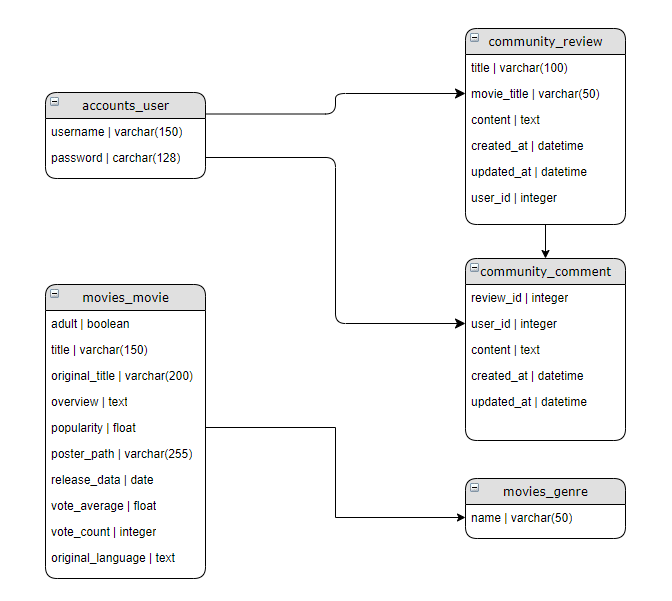

# final-pjt

```
각 항목들에서 줄 위는 django part, 줄 아래는 vue part임을 미리 알림.
```

## i. 팀원 정보 및 업무 분담 내역

- 채경혜 - backend(django)

----------

- 이원우 - frontend(vue) and CSS


## ii. 목표 서비스 구현 및 실제 구현 정도

- 명세서가 요구하는 바의 95%..정도 까지는 구현해낸 것 같다(vue, django )


## iii. 데이터베이스 모델링(ERD)



## iv. 필수 기능에 대한 설명

###	A. 관리자 뷰

- 관리자 권한 유저에게만 영화 등록 / 수정 / 삭제 권한 부여
- 관리자 권한 유저에게만 유저 관리 권한 부여

-----------

* Vue.js로 처리한 내용 없음


### 	B. 영화 정보

- 영화 정보 제공
- 로그인 된 유저는 영화에 대한 평점 등록 / 수정 / 삭제 가능
- 영화 정보 검색 기능  [참고링크](https://stackpython.medium.com/django-search-with-q-objects-tutorial-9c701db74e0e)
- 최신 영화, 인기 영화, 오늘의 추천 영화 추천 기능

------------

- 영화 정보는 tmdb를 통해 직접 만든 db와 tmdb api를 이용하여 활용
- 유저 각각이 영화에 대한 평점 등록 가능, 삭제 가능(수정 X)


### 	C. 추천 알고리즘

- 평점을 등록한 유저는 해당 장르 영화 추천 받는 기능

-----

- A 영화에 평점을 등록한 유저는 A 영화의 genre를 기억(저장)해두고 db를 돌면서 같은 값이 있다면 출력되는 방식으로 구현하려고 했으나(80% 완성), tmdb의 추천알고리즘 기능을 활용함
- 내가 평점을 '준' 영화라면 모두 가져오는 것이 아닌, 7점 이상 준 영화에 대해서만 가져올 수 있는 로직 작성(예정)


### 	D. 커뮤니티

- 로그인 사용자만 글을 조회 / 생성 가능
- 로그인 사용자는 본인 글 수정 / 삭제 가능
- 로그인 사용자는 게시글에 댓글 작성 가능
- 로그인 사용자는 본인 댓글 삭제 가능
- 게시글 및 댓글에 생성 / 수정 시각 정보 제공

-----------

- 로그인한 사용자만 글을 조회/생성 할 수 있음
- 작성된 게시물에 댓글 작성 가능, 본인만 댓글 삭제 가능(삭제 버튼은 보이는 상태)
- 각 게시글 및 댓글은 생성 및 수정 시각 정보가 포함되어 있음


### E. 기타

- Vue에서 받은 query요청을 url에 붙여서 검색결과를 return하는 로직 작성

-------------

- 명세에 없는 내용 중 하나인, youtube api를 사용한 검색 기능을 사용
- 해당 영화의 트레일러를 찾아서 띄우고 싶었으나, 기술적(...)한계로 인해 포기
- tmdb search기능을 이용해 더 많은 db를 자유롭게 검색할 수 있는 기능을 구현함
  - 팀원이 직접 만든 db내에서 검색하는 방법을 이미 구현해놨기 때문에 로직은 사실상 동일했음

## v. 배포 서버 URL

- 미구현

## vi. 기타(느낀 점)

- 채경혜

  > 혼자서 절대 해내지 못했을 프로젝트였는데, 원우 님의 엄청난 실력으로 잘 마무리 지을 수 있었습니다. django에서 구조를 잘 잡아줘야, vue에서 편하게 작업할 수 있는데 사소한 오타에서부터 username 대신 user_id가 나오는 상황, 기능 구현을 다 했지만 serializing을 하지 못해 난감했던 상황, 온갖 error 메세지는 다 만나보게 된 프로젝트였습니다. 처음부터 끝까지 django를 작성하면서 이제껏 배웠던 내용들을 순차대로 정리할 수 있는 유익한 시간이었습니다.

-------

- 이원우

  > 첫 날부터 막막했었다. Vue를 들어가고부터는 emit이니 props니 event bus니 life cycle hook이니 별의 별 개념들이 난무해서 파이썬을 처음 배우던 시절보다 어지러웠던 것 같다.
  >
  > 
  >
  > vue를 쳐서 기본 틀을 만드는 것 마저 어색했던 초반에 서로 오랜 시간(일주일 밖에 안되지만)을 두고 하는 프로젝트다보니 서로 작업을 따로 했던 것 같다. 그러다보니 모델을 짠다거나, 이름이 서로 다르다거나(django에서는 커뮤니티에 쓰는 글의 이름이 review, Vue에서는 커뮤니티에 쓰는 글 이름이 article) 한 경우에 굉장히 난처하고 헷갈렸던 것 같다. 서비스하게 되면 겉으로는 드러나지 않을 정보들일수도 있지만, 세세한 부분이 '처음부터' 중요하다는 생각이 들었다.
  >
  > 
  >
  > 설계도도 없이 그저 시간에 쫓겨 공사를 시작하다보니 중간중간 부실공사..가 될 우려가 있었으나 백엔드 팀원의 도움이 굉장히 컸다. Vue와 django는 문법이 조금 다르다보니 True와 true를 헷갈린다거나.. 장고에서 '원본'에 손을 대지 않는 로직이 있고, 대는 로직에 따라 Vue가 보내는 요청의 방식과 받는 방법이 천차만별이라는 것을 깨달았다. 반 동료들의 도움으로 emit이나 map같은 기능들도 쓰게 됐는데, 굉장히 유용하고 꼭 필요하다는 것을 느꼈다. ~~mixin을 못써서 아쉽다~~
  >
  > 
  >
  > front를 하면서 느낀 것은, 내가 back보단 front 쪽이라는 것. ssafy에 처음 입과할 때는 front와 back이 뭔지도 잘 몰랐는데(~~사실 프로젝트 시작 전까지도 잘 몰랐음~~) 이제는 조금은 알게 된 것 같다. 구글에 검색을 하는 방법이라거나, cdn을 읽는 방법. 다른 라이브러리와 모듈들을 불러와서 사용하고 커스터마이징 하는 방법. 나아가 CSS를 다루는 방법까지(~~CSS is awesome~~)  조금은..아주 조금은 숙달된 것 같아서 다행이라고 생각한다.