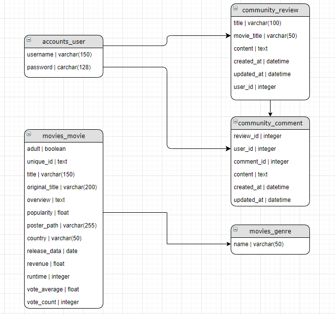

# README


## 0. 팀원 정보 및 업무 분담 내역

* 채경혜 : 장고 로직 구현
* 이원우 : Vue 로직 구현


## 1. 로컬 실행 방법

```bash
$ pip install -r requirements.txt
```

```bash
$ python manage.py migrate
$ python manage.py runserver
```


## 2. DB 모델링




## 3. 필수 기능에 대한 설명

### 1) 관리자 권한

* 관리자 권한 유저에게만 영화 등록 / 수정 / 삭제 권한 부여
* 관리자 권한 유저에게만 유저 관리 권한 부여


### 2) 영화 정보

* 영화 정보 제공
* 로그인 된 유저는 영화에 대한 평점 등록 / 수정 / 삭제 가능


### 3) 추천 알고리즘

* 평점을 등록한 유저는 해당 정보를 기반으로 영화 추천 받는 기능


### 4) 커뮤니티

* 로그인 사용자만 글을 조회 / 생성 가능
* 로그인 사용자는 본인 글 수정 / 삭제 가능
* 로그인 사용자는 게시글에 댓글 작성 가능
* 로그인 사용자는 본인 댓글 삭제 가능
* 게시글 및 댓글에 생성 / 수정 시각 정보 제공


## 4. 기타 (느낀점)


